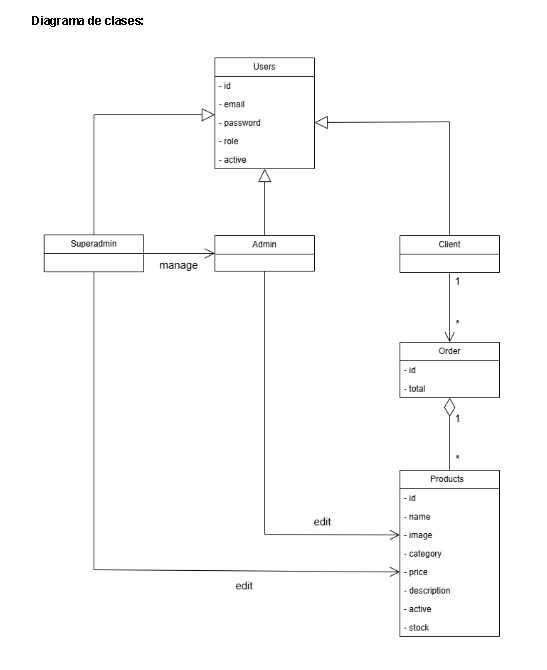

# SISTEMA DE GESTIÓN Y E-COMMERCE DE PRODUCTOS TECNOLÓGICOS

**Grupo:** Agustín Vella, Franco Mecoli  
**Repo:** [Link](https://github.com/AGN20486/TPI-Programacion4-EcommerTecnologia)

---

## Minuta de Relevamiento

### Previo al sistema
Actualmente, las consultas y compras de productos tecnológicos por parte de los clientes se realizan de forma presencial o informal a través de mensajes en redes sociales. El comprador consulta disponibilidad, especificaciones técnicas y precios de componentes o dispositivos, requiriendo que el vendedor interrumpa sus tareas para revisar manualmente listas de precios en archivos o verificar físicamente la existencia del producto en el depósito.

La falta de un catálogo digital unificado obliga a los clientes a depender exclusivamente del tiempo de respuesta del comercio para conocer el catálogo disponible.

La gestión del negocio se lleva a cabo mediante anotaciones en planillas físicas o archivos dispersos. Esto dificulta el seguimiento exacto de las ventas del día, el control de inventario y la identificación de productos agotados, generando inconsistencias en los pedidos y pérdidas de oportunidades de venta.

### Con sistema
Cuando un cliente desea adquirir un producto tecnológico o consultar el catálogo, ingresa a la plataforma web. Puede navegar libremente por el sitio para explorar los productos, utilizar la búsqueda por palabras clave o aplicar filtros por categoría y rango de precio. Para concretar una orden, el cliente inicia sesión con sus credenciales.

Al seleccionar un producto, el usuario accede a sus especificaciones, precio actualizado antes de añadirlo a su carrito de compras.

Una vez confirmada la operación, el backend registra el pedido en la base de datos y descuenta de forma automática las unidades vendidas del inventario general. Desde el panel de administración centralizado, el personal encargado puede gestionar el estado de las órdenes (aprobar, preparar, enviar), actualizar los precios y dar de alta, editar o eliminar productos del catálogo de manera instantánea.

---

## Diagrama de Clases

